# 安卓平台光·遇国服AR相机功能不显示问题解决方案

> *方法并非完全通用，效果因设备而异。*
> **下文中的 光·遇 指的是 国服光·遇 ，不适用于 Sky国际服(Live)、Sky Beta、Sky Live Preview**

## 概述

安卓国服《光·遇》的AR相机功能依赖设备底层的增强现实（AR）服务支持。在国行安卓手机与平板上，AR相机不显示通常由以下四种情况导致：

1. 设备不在谷歌[ARCore支持列表](https://developers.google.cn/ar/devices?hl=zh-cn)：部分机型未通过谷歌官方认证，系统无法调用(Google)ARCore能力；

2. 设备厂商未预装AR服务：虽然设备硬件支持，但厂商未预装 `Google Play Services for AR`（谷歌AR服务）。部分型号可在 `对应厂商的应用市场(通常预装)` 或 `Google Play 商店` 搜索 `Google Play Services for AR` 安装该应用后恢复功能；

> 注: 部分设备也可以通过其它渠道下载正确的 `Google Play Services for AR` 安装包，自行安装实现支持

3. 设备不支持GMS（谷歌移动服务）：因缺少谷歌服务框架，无法运行ARCore。此类设备通常无法通过安装 `Google Play Services for AR` 解决；

4. 华为设备(EMUI(部分华为荣耀为MagicUI)或包含AOSP的HarmonyOS)：光·遇(仅国服)集成了华为AR服务，支持使用华为`AREngineServer`替代谷歌AR服务。需确认系统应用中已包含该应用，并参考[华为AR Engine支持的设备列表](https://developer.huawei.com/consumer/cn/doc/graphics-Guides/introduction-0000001050130900#section9965311205512)检查当前使用的设备是否支持。

根据以上不同情况，用户可对照自身设备尝试对应解决方案，以恢复《光·遇》AR相机的正常显示与使用。

## 分析

通过使用 [**LibChecker**](https://github.com/LibChecker/LibChecker/releases) 分析光·遇国服安卓端的应用安装包，在“原生库”（Native Libraries）列表中可以发现以下两个与华为AR能力相关的动态库文件：

- `libhuawei_arengine_jni.so`
- `libhuawei_arengine_ndk.so`

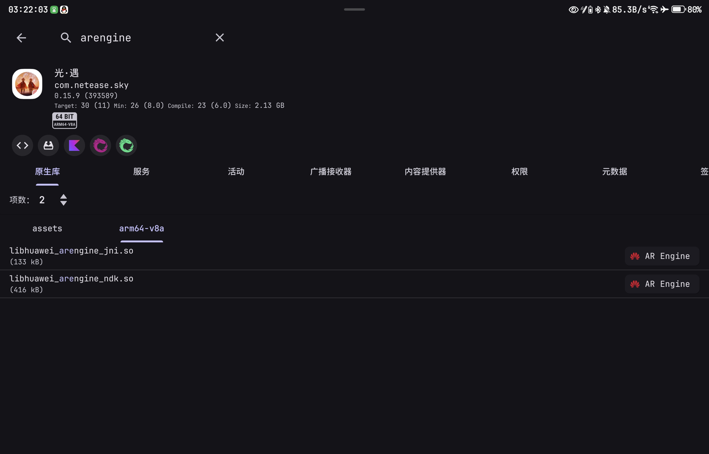

这两个库文件的命名与华为移动服务（HMS）中提供的 **AR Engine** 组件接口完全对应。其中，`jni` 后缀用于Java本地接口调用，`ndk` 后缀则表明游戏引擎通过NDK方式直接与华为AR Engine底层交互。

## 解决方案

这里以荣耀终端(*非华为荣耀*)为例

截至到2026年6月12日(即 光·遇 v0.15.9 发布日期)，没有一款**大陆国行荣耀终端**(手机/平板/折叠屏)在[ARCore支持列表](https://developers.google.cn/ar/devices?hl=zh-cn)中。

因此分别使用 [HONOR GT Pro](https://www.honor.com/cn/phones/honor-gt-pro/) 和 [HONOR Tablet GT2 Pro](https://www.honor.com/cn/tablets/honor-pad-gt-2-pro/) 作为演示。

### 环境

本次使用的 `AREngineServer` 安装包来自 `Huawei Mate 30 Pro 5G` 版本为 `4.0.7.300`

### 手机示例

> 设备名称 HONOR GT Pro
>
> 设备型号 PPG-AN00
>
> Android 16(Baklava)

直接启动光遇，右上角"齿轮"菜单中不显示 AR 相机 按钮

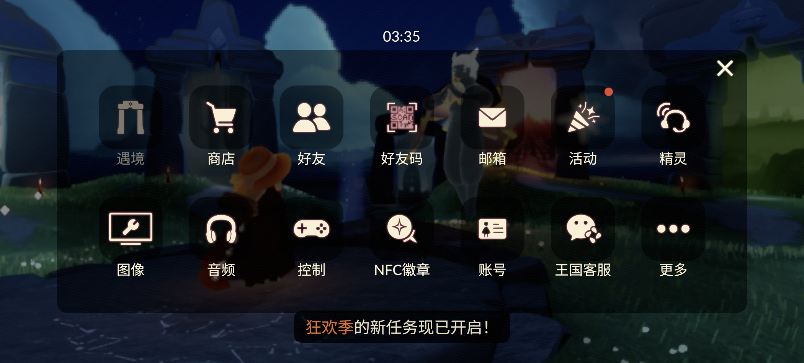

安装 `AREngineServer` 

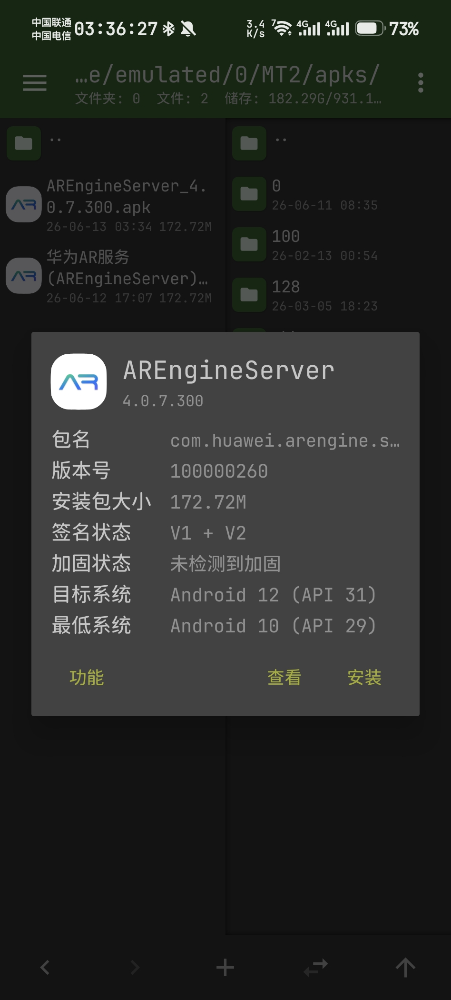

等待完成

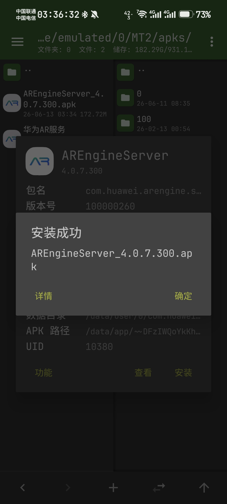

启动光·遇，打开右上角"齿轮"菜单

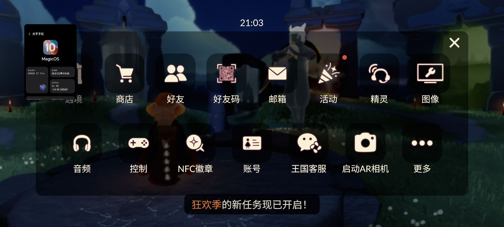

已经显示 AR 相机 按钮，点击启动

> 当识别到正确的AR码(同时支持国际服AR码)后，点击中间下方按钮显示光之子

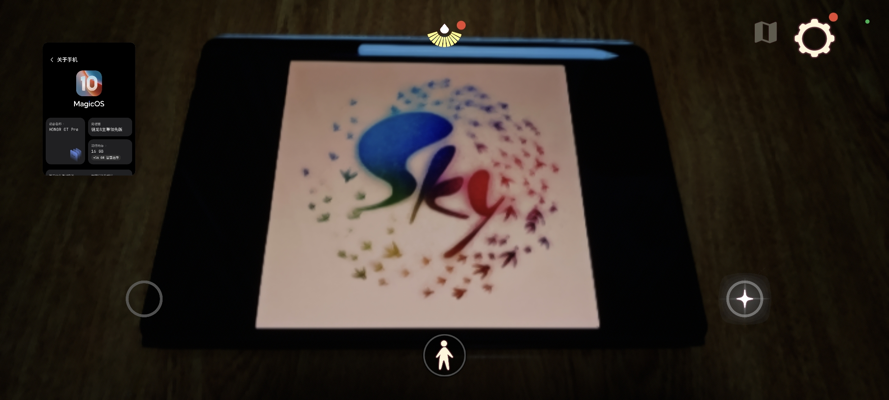

> 出现光之子后，通过点击中间下方按钮调整光之子和建造物大小

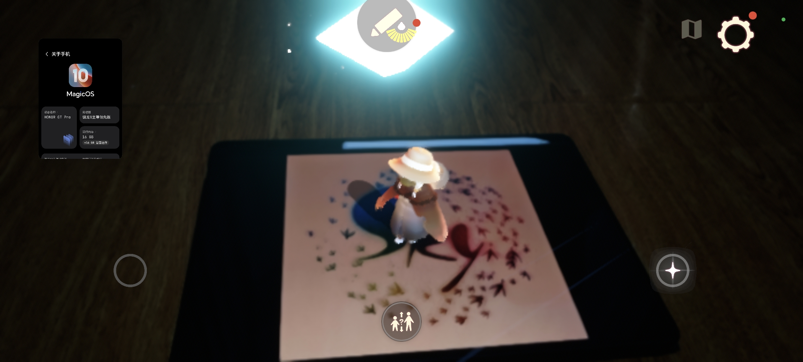

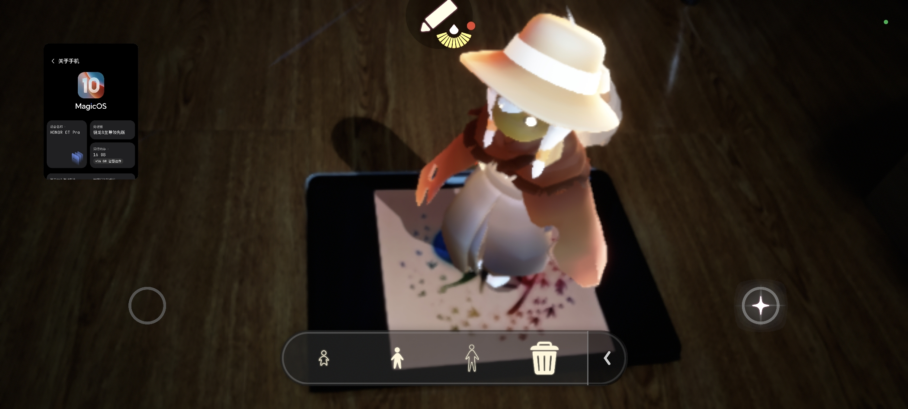

### 平板示例

> 设备名称 HONOR Tablet GT2 Pro
>
> 设备型号 CHG-W60
>
> Android 16(Baklava) (CGL-W60)

直接启动光遇，右上角"齿轮"菜单中不显示 AR 相机 按钮

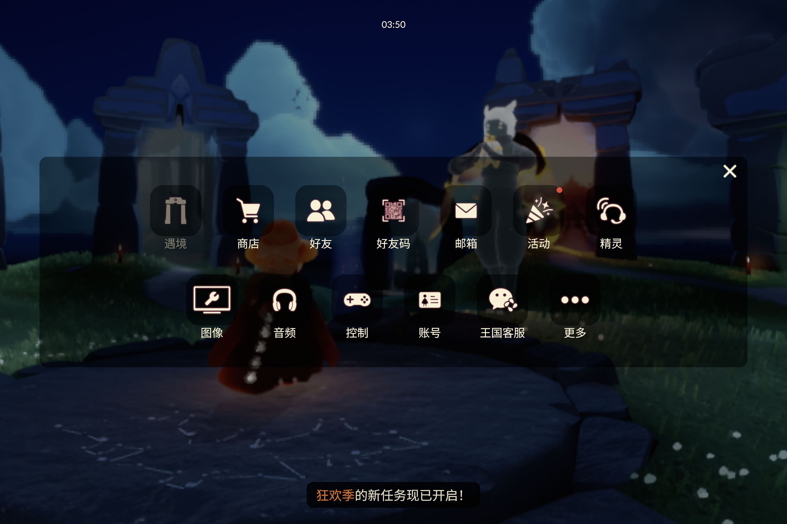

安装 `AREngineServer` 

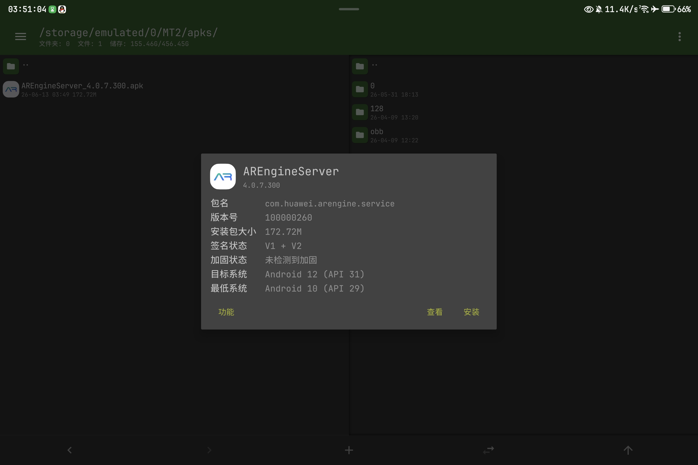

等待完成

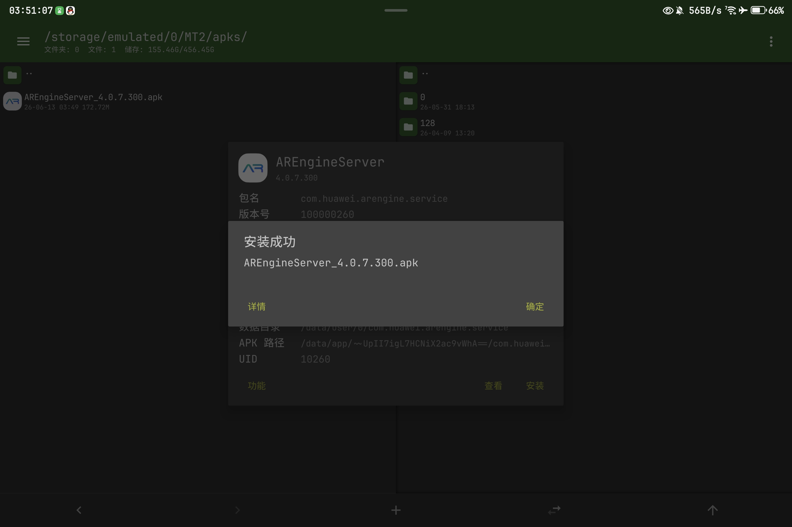

启动光·遇，打开右上角"齿轮"菜单

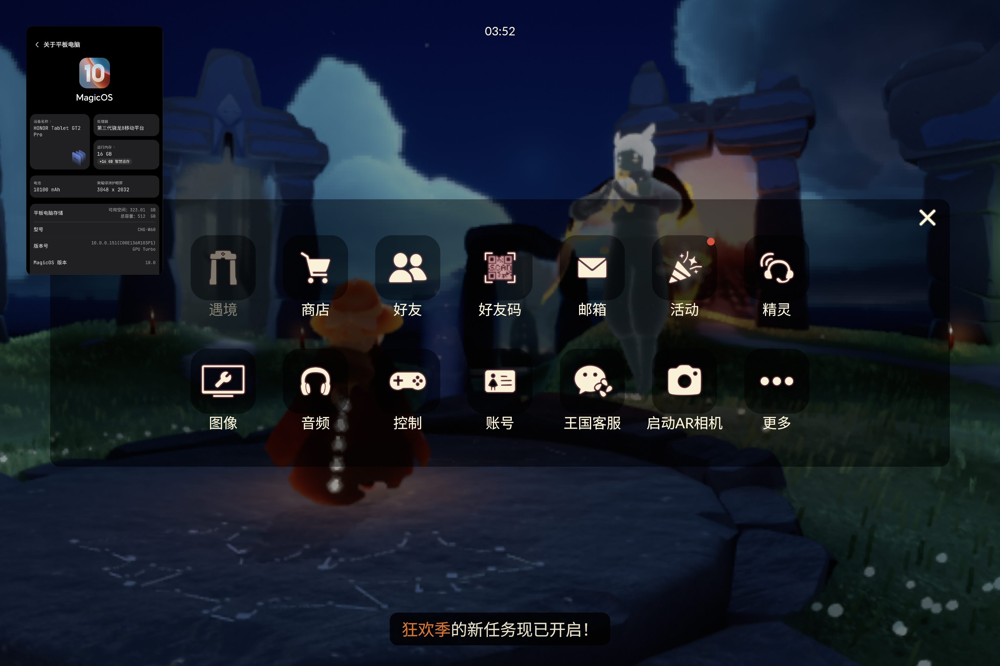

已经显示 AR 相机 按钮，点击启动

> 当识别到正确的AR码(同时支持国际服AR码)后，点击中间下方按钮显示光之子

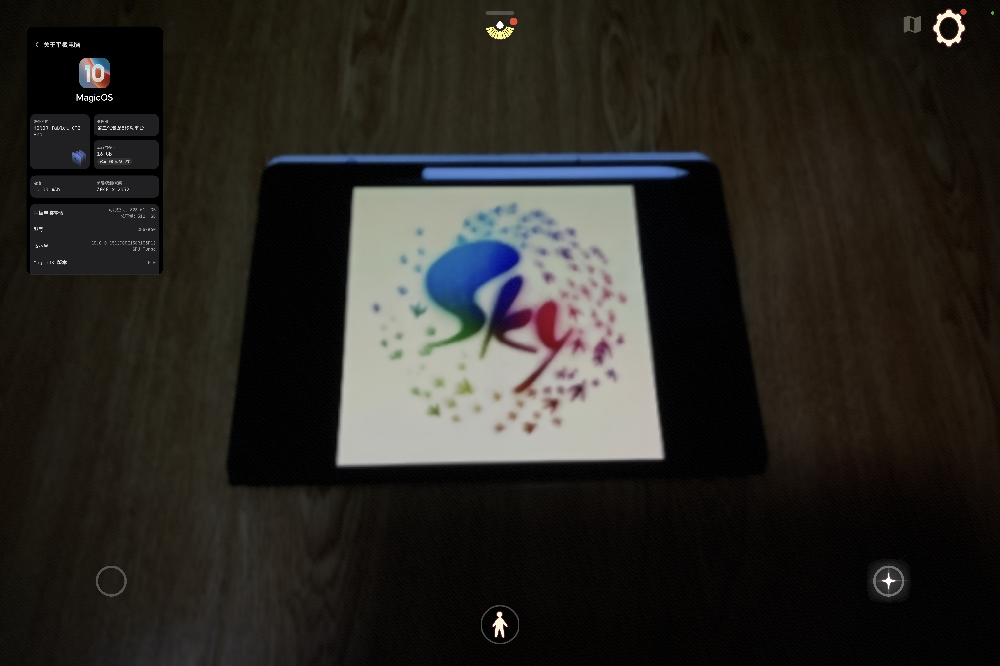

> 出现光之子后，通过点击中间下方按钮调整光之子和建造物大小

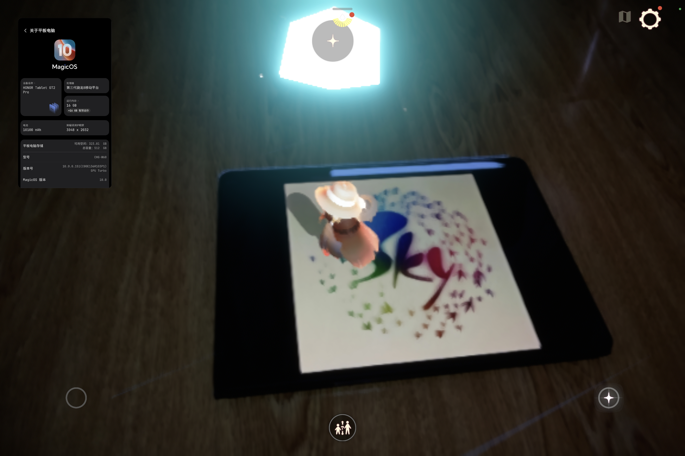

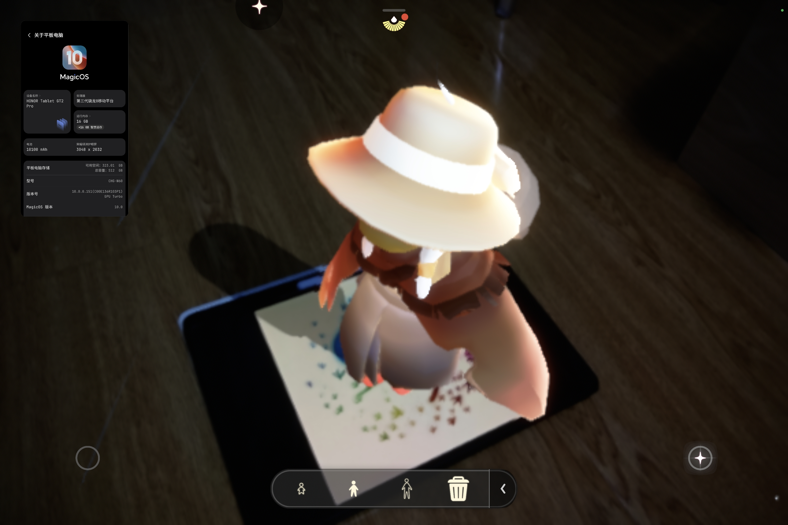

### 注意

**这并非适用于全部不支持ARCore的设备，部分设备安装后可能仍存在无法启动的问题!**

#### 手机示例

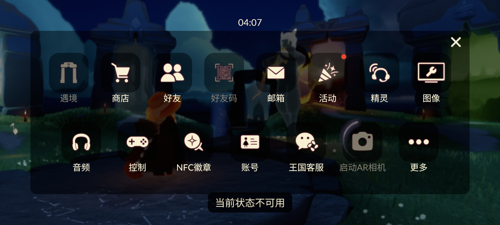

#### 平板示例

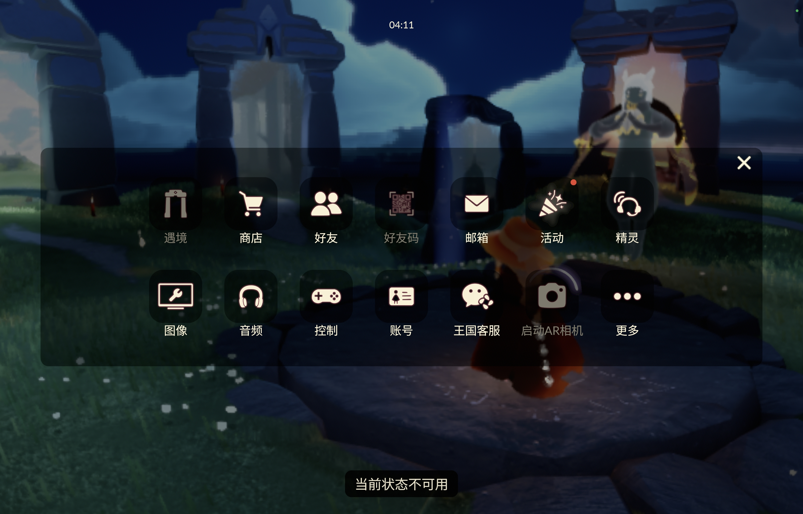

## 许可证

本 README 文档及所有文档、图片均采用 [CC BY-NC-SA 4.0 许可证](https://creativecommons.org/licenses/by-nc-sa/4.0/) 授权

安装包文件来自[华为应用市场](https://consumer.huawei.com/cn/mobileservices/appgallery/)